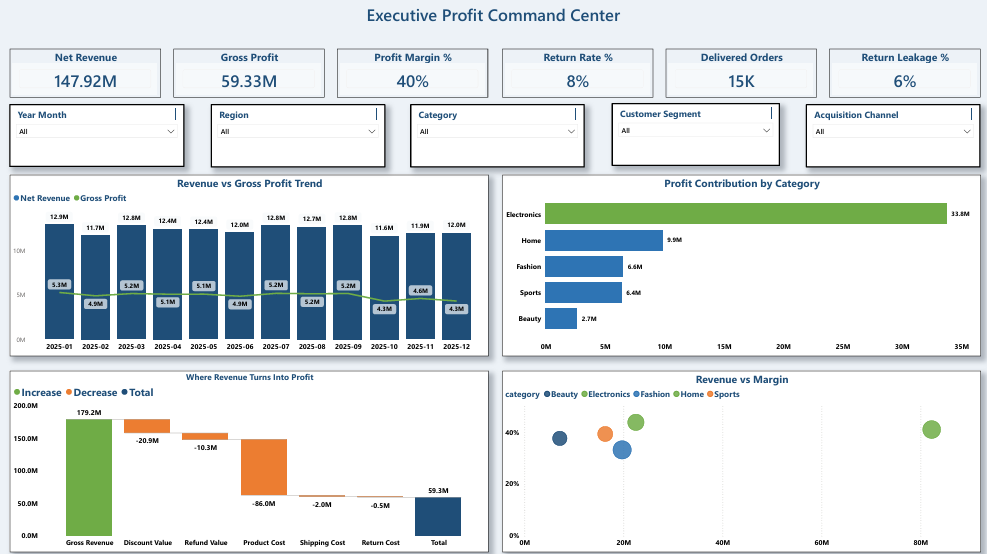
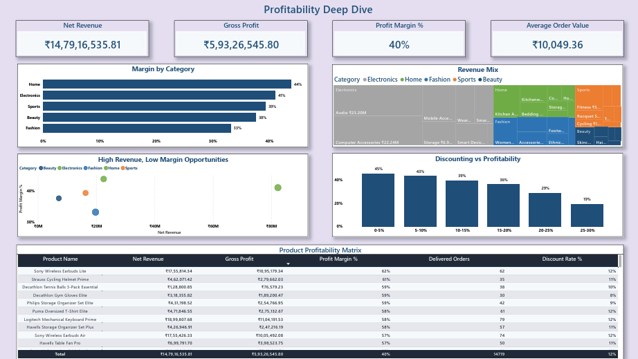
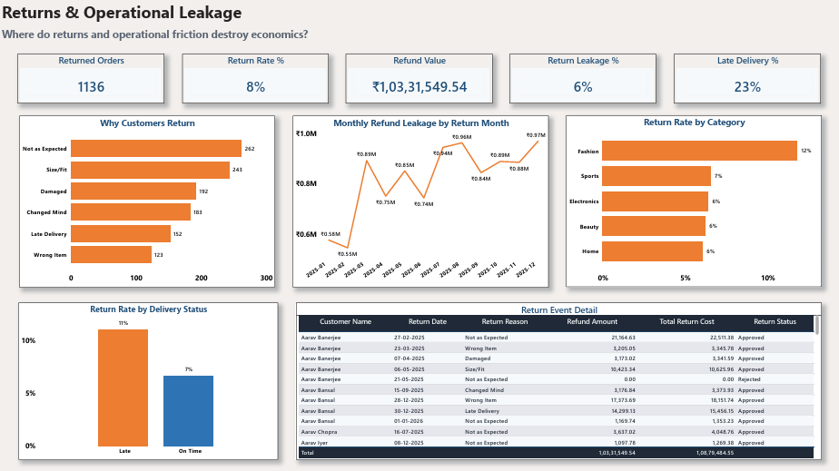
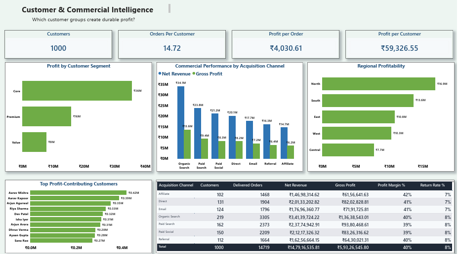

# 💰 ProfitTrace | E-Commerce Profitability & Returns Intelligence

> **Trace the Revenue. Find the Leakage. Protect the Profit.**

ProfitTrace is an end-to-end analytics portfolio project built around a practical commercial question:

> **Revenue looks healthy, but where is the business actually losing profit?**

The project follows a realistic analyst workflow from source data in Excel, through SQL Server for validation, cleaning and business analysis, to Power BI for a decision-focused executive dashboard.

The final implementation includes:

- SQL Server staging, validation, cleaning, analytical views, business analysis and QA
- A Power BI star schema with two fact tables and three dimensions
- **32 DAX measures** covering profitability, returns, operations and customer economics
- A polished **4-page Power BI dashboard**
- Final PBIX, PDF export and dashboard screenshots

The source dataset is synthetic and intentionally includes controlled data-quality issues so the project demonstrates how an analyst handles imperfect operational data.

## 🎯 Business Case

An e-commerce business wants to grow revenue without quietly giving away margin. Leadership needs to understand:

- Which categories and products create the most profit?
- Where are discounts eroding margin?
- Which products generate strong sales but weak economics?
- How much financial leakage is associated with returns?
- How do late-delivery patterns relate to return activity?
- Which customer segments and acquisition channels create stronger economics?

## 🔄 End-to-End Workflow

```text
Raw Excel / CSV
      ↓
SQL Server Staging
      ↓
Data Quality Validation
      ↓
Cleaning & Standardization
      ↓
Analytical SQL Views
      ↓
Business Analysis + QA
      ↓
Power BI Star Schema
      ↓
32 DAX Measures
      ↓
4-Page Executive Dashboard
```

## 🧰 Tool Stack

| Tool | Purpose |
|---|---|
| **Excel / CSV** | Source data |
| **SQL Server / SSMS** | Staging, validation, cleaning, transformation, QA and business analysis |
| **Power BI** | Data modeling, DAX and dashboarding |
| **DAX** | KPI calculations and interactive business metrics |
| **GitHub** | Versioned portfolio evidence and documentation |

## 📊 Source Data

| Entity | Records | Purpose |
|---|---:|---|
| Customers | 1,000 | Customer identity, geography, segment and acquisition source |
| Products | 300 | Product, category, brand, tier, price, cost and rating |
| Orders | 15,000 | Order-product transactions and commercial attributes |
| Shipping | 15,000 | Shipment timing, delivery status, carrier and shipping cost |
| Returns | 1,155 | Return events, reasons and financial impact |

The data contains controlled quality issues such as inconsistent text casing/whitespace, one discount above the approved 0%–30% business range, and incomplete shipping dates. These issues are surfaced during validation and handled in the SQL cleaning layer.

## 🗄️ SQL Architecture

The SQL workflow is intentionally split into seven auditable scripts:

```text
01_Database_Setup.sql
02_Import_Raw_Data.sql
03_Data_Validation.sql
04_Data_Cleaning.sql
05_Business_Analysis.sql
06_Post_Load_QA.sql
07_Final_Portfolio_QA.sql
```

Key SQL practices demonstrated:

- Typed staging tables
- Raw-data quality checks
- Text standardization
- TRY_CONVERT / NULLIF handling for imperfect source values
- CTEs and aggregations
- Order-level financial allocation to preserve analytical grain
- Profitability and return analysis
- Post-load reconciliation and final portfolio QA

### Delivered-order scope

`is_delivered = 1` is the project definition for delivered commercial scope. Core SQL profitability metrics and the corresponding Power BI measures use this same flag so the two layers analyze the same realized-order population.

## ⭐ Power BI Model

The final semantic model uses a simple star schema:

```text
                         DimDate
                        /       \
                       /         \
DimCustomer ---- FactProfitability ---- DimProduct
                       |
                   FactReturns
```

### Tables

**Facts**

- `FactProfitability` from `analytics.vw_OrderProfitability`
- `FactReturns` from `analytics.vw_ReturnsOperations`

**Dimensions**

- `DimDate`
- `DimCustomer`
- `DimProduct`

The model uses 1:* single-direction relationships from dimensions to facts. There is no direct fact-to-fact relationship.

The returns source does not contain a reliable product identifier, so return-event visuals are intentionally kept at return/customer/channel/region level rather than creating unsupported product/category attribution.

## 📈 Final Dashboard

### 1. Executive Profit Command Center

A management view of the core economics with KPI cards for:

- Net Revenue
- Gross Profit
- Profit Margin %
- Return Rate %
- Delivered Orders
- Return Leakage %

Supporting visuals include monthly revenue vs profit, category profit contribution, the revenue-to-profit waterfall and revenue-vs-margin analysis.

### 2. Profitability Deep Dive

A product and category profitability view with:

- Margin by Category
- Revenue Mix
- High Revenue, Low Margin Opportunities
- Discounting vs Profitability
- Product Profitability Matrix

### 3. Returns & Operational Leakage

A focused view of operational and financial leakage with:

- Returned Orders
- Return Rate %
- Refund Value
- Return Leakage %
- Late Delivery %

Visuals cover return reasons, monthly refund leakage, return-reason mix, delivery performance vs returns and return-event detail.

### 4. Customer & Commercial Intelligence

A commercial view with:

- Customers
- Orders per Customer
- Repeat Customer %
- Profit per Customer

Visuals cover customer segments, acquisition channels, regional profitability, top profit-contributing customers and a channel scorecard.

## 📌 Observed Dashboard Snapshot

The final report currently shows these headline values in the delivered-order analytical scope:

| KPI | Dashboard value |
|---|---:|
| Net Revenue | 147.92M |
| Gross Profit | 59.33M |
| Profit Margin | 40% |
| AOV | 10.05K |
| Customers | 1K |
| Orders per Customer | 14.72 |
| Repeat Customer % | 100% |
| Profit per Customer | 59.33K |

Because the dataset is synthetic, these values demonstrate the model and analytical workflow rather than representing a real business.

## 🖼️ Dashboard Preview

### Executive Profit Command Center


### Profitability Deep Dive


### Returns & Operational Leakage


### Customer & Commercial Intelligence


## 📥 Final Portfolio Files

- [Download the final Power BI report (PBIX)](powerbi/ProfitTrace_Dashboard.pbix)
- [View the exported dashboard PDF](ProfitTrace_Dashboard.pdf)
- [View the SQL scripts](sql/)
- [View the dashboard documentation](powerbi/)
- [View the final screenshots](screenshots/)

## 📁 Repository Structure

```text
ProfitTrace/
├── ProfitTrace_Dashboard.pdf
├── README.md
├── data/
├── documentation/
│   ├── PROJECT_BRIEF.md
│   ├── DATA_DICTIONARY.md
│   ├── DATA_GENERATION.md
│   ├── BUILD_RUNBOOK.md
│   ├── HANDS_ON_BUILD_GUIDE.md
│   ├── PORTFOLIO_QA_CHECKLIST.md
│   ├── POWERBI_BUILD_CHECKLIST.md
│   └── RECRUITER_REVIEW.md
├── powerbi/
│   ├── ProfitTrace_Dashboard.pbix
│   ├── DASHBOARD_BLUEPRINT.md
│   ├── BUILD_HANDOFF.md
│   ├── DAX_MEASURES.md
│   └── PROFITTRACE_THEME.json
├── screenshots/
│   ├── executive_profit_command_center.png
│   ├── profitability_deep_dive.png
│   ├── returns_operational_leakage.png
│   └── customer_commercial_intelligence.png
└── sql/
    ├── 01_Database_Setup.sql
    ├── 02_Import_Raw_Data.sql
    ├── 03_Data_Validation.sql
    ├── 04_Data_Cleaning.sql
    ├── 05_Business_Analysis.sql
    ├── 06_Post_Load_QA.sql
    └── 07_Final_Portfolio_QA.sql
```

## ✅ Project Status

**Portfolio build complete.**

- [x] Business case and scope
- [x] Source dataset and data-quality issues
- [x] SQL staging and import workflow
- [x] Validation and cleaning logic
- [x] Business analysis queries
- [x] Post-load and final QA
- [x] Power BI star schema
- [x] 32 DAX measures
- [x] Four-page dashboard
- [x] Final screenshots
- [x] PDF export
- [x] PBIX portfolio file
- [x] GitHub repository evidence

## ⚠️ Analytical Discipline

ProfitTrace distinguishes **observed association from causation**. For example, a higher return rate among late-delivery orders is an observed relationship in the synthetic dataset; it is not proof that late delivery caused every return.

The return source has no reliable product identifier, so the project does not invent product/category return attribution.

## 👤 Author

**Kushank Kashyap**  
Data Analyst | Business Analyst | BI Analyst

**Core skills:** SQL • Power BI • DAX • Excel • Data Modeling • Business Analysis • Data Storytelling
